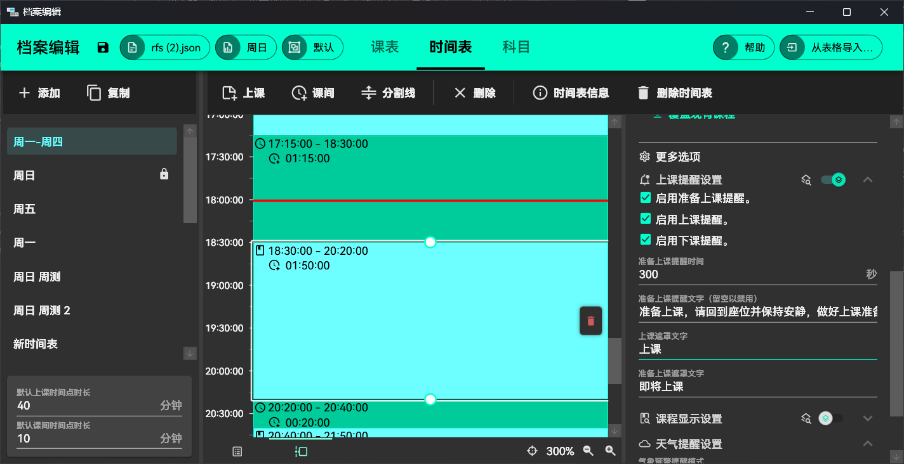
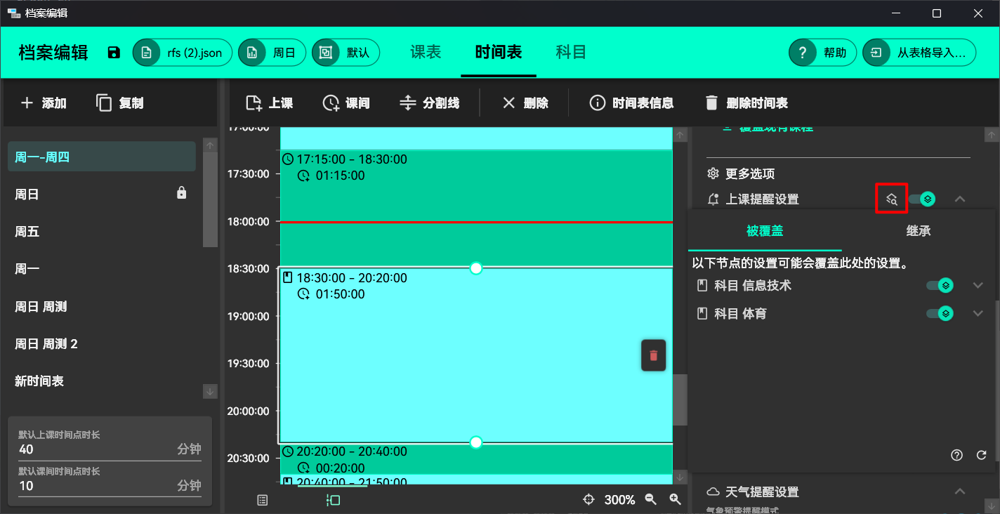
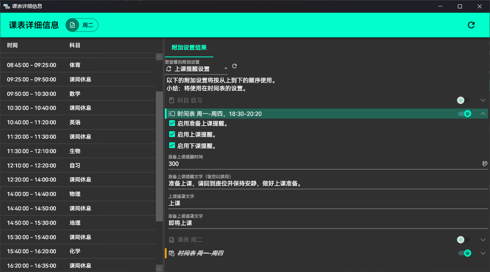
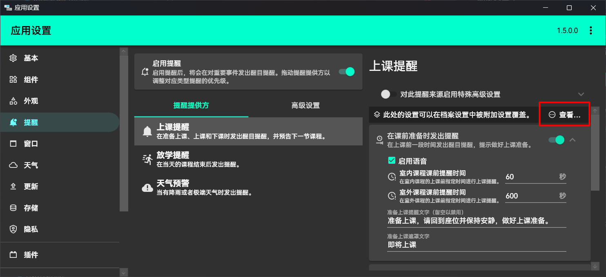
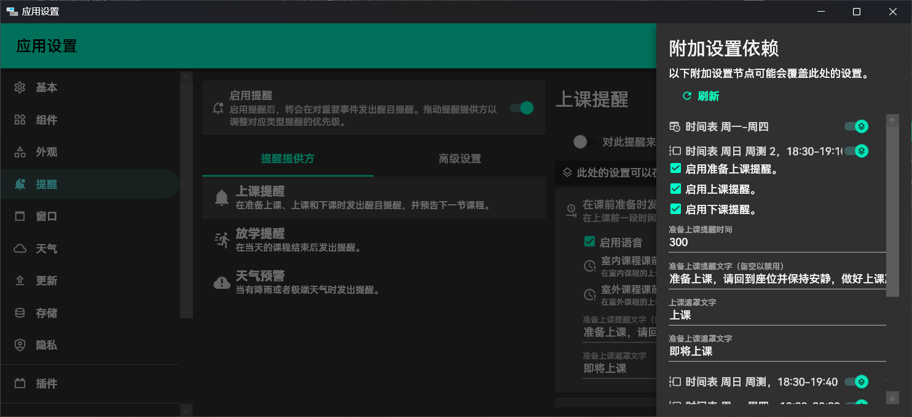

# 附加设置

应用中的一些设置可以在科目、时间点、课表和时间表中单独设置，并覆盖全局设置。本文将介绍用户配置附加设置的方法。

各个层级的附加设置应用级别如下图所示。如果在这个层级上启用了附加设置，那么这部分附加设置会完全覆盖上级和全局的设置。

您可以进入这些元素的编辑页面，在【更多设置】一栏中编辑相关的设置，例如下图：

上图在时间表的一个时间点上启用了上课提醒设置的附加设置，这样在这个时间点时，会无视在【提醒】的全局设置，使用这里的上课提醒设置。

以下是具有附加设置的设置，在对应处打“√”即意味着这个设置可以在这个元素上单独进行设置。有的插件可能会扩展额外的设置。

| 设置名 | 科目 | 时间点 | 课表 | 时间表 |
| -- | -- | -- | -- | -- |
| 上下课提醒 | √ | √ | √ | √ |
| 时间点附加信息 | √ | √ | √ | √ |
| 时间点结束倒计时 | √ | √ | √ | √ |
| 放学提醒 |  |  | √ | √ |
| 气象预警提醒、天气预报 | | √ | |  |

## 附加设置分析

当在多个节点设置附加设置后，附加设置的依赖关系可能会变得比较复杂，且难以调试。您可以使用附加设置分析功能，在附加设置节点、课表看板和附加设置对应的全局设置查看附加设置的覆盖和继承状态，并调整各个节点的设置和启用状态。

您可以点击附加设置节点上的【插件按此设置的继承情况…】按钮来查看并调整此处设置的覆盖和继承关系。

您也可以在选中课表后，点击【详细看板…】查看这个课表所有时间点的附加设置启用和覆盖状态，并便利地编辑各个节点上的设置。

您也可以在一些支持的全局设置界面处，查看并调整对应的附加设置对全局设置的覆盖情况。

