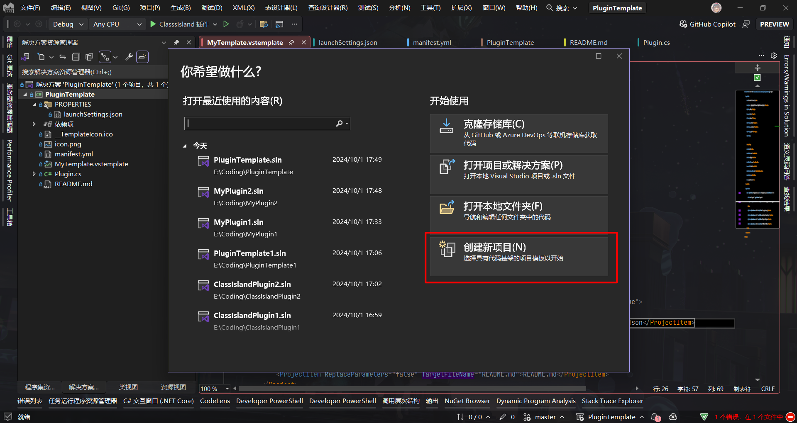
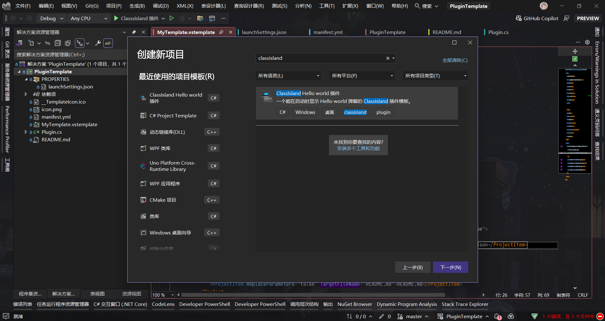
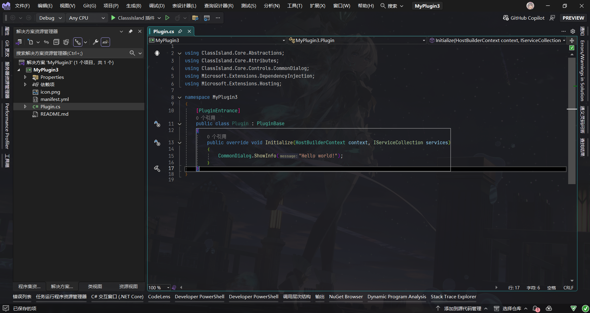

# 开始编写插件

本文章将介绍如何创建、调试并运行 ClassIsland 的插件项目。

::: warning
本文章所涉及内容仍在开发中，随时可能发生变动。请注意关注文档更变。
:::

在开始之前，您需要按照[设置 ClassIsland 插件开发环境](../get-started/devlopment-plugins.md)的指引设置插件开发环境。

## 创建项目

有两种方法创建项目：

:::tabs 
@tab 使用模板（推荐）

您可以使用项目模板快速开始开发。

1. 前往 [插件模板仓库](https://github.com/ClassIsland/PluginTemplate/releases/latest) 中下载插件模板（PluginTemplate.zip）
2. 将下载的压缩包复制到`%USERPROFILE%\Documents\Visual Studio 2022\Templates\ProjectTemplates`（以 VS 2022 为例，以你电脑上的具体目录为准）
3. 打开 Visual Studio
4. 在【启动窗口】点击【创建新项目】
    
5. 在模板列表搜索“classisland”，选择【ClassIslad Hello world 插件】模板创建项目
    
6. 大功告成🎉，开始你的 ClassIsland 插件开发之旅吧！
    

插件模板已经配置好本文章的大部分内容，继续阅读本文章时您可以省略接下来的步骤，只需了解这些文件的作用即可。

@tab 手动创建

以下步骤以在 Visual Studio 2022 中的操作为例。

1. 创建一个模板为【WPF 类库】的项目，选择【.NET 8】目标框架
2. 项目创建完成后，在【解决方案资源管理器】中右键项目，在弹出的操作菜单中点击【管理 Nuget 程序包…】操作。

    

3. 搜索并安装包【ClassIsland.PluginSdk】。

    

    ::: info 使用预览版 SDK
    您可以通过添加 GitHub Packages 源来获取从 GitHub Actions 构建的最新的 SDK 包。您需要按照[此文章](https://docs.github.com/zh/authentication/keeping-your-account-and-data-secure/managing-your-personal-access-tokens)的方法创建 GitHub 个人访问令牌（classic），并至少赋予 `read:packages` 权限。然后使用以下命令添加 ClassIsland 的 GitHub Packages Nuget 源：

    ``` shell
    dotnet nuget add source --username（你的用户名） --password（你的 GitHub 个人访问令牌） --store-password-in-clear-text --name github "https://nuget.pkg.github.com/ClassIsland/index.json"
    ```
    :::

4. 打开项目文件，添加 `EnableDynamicLoading` 属性以允许插件被动态加载，并在 `ClassIsland.PluginSdk` 的引用项上设置`ExcludeAssets` 属性为 `runtime` 以阻止插件 SDK 相关依赖项流入构建结果。

    ```xml title="MyPlugin.csproj" hl_lines="9 13"
    <Project Sdk="Microsoft.NET.Sdk">

        <PropertyGroup>
            <TargetFramework>net8.0-windows</TargetFramework>
            <Nullable>enable</Nullable>
            <UseWPF>true</UseWPF>
            <ImplicitUsings>enable</ImplicitUsings>
            <PlatformTarget>x64</PlatformTarget>
            <EnableDynamicLoading>True</EnableDynamicLoading>
        </PropertyGroup>
        <ItemGroup>
            <PackageReference Include="ClassIsland.PluginSdk" Version="1.0.0">
                <ExcludeAssets>runtime</ExcludeAssets>
            </PackageReference>
        </ItemGroup>
    </Project>

    ```

:::

## 插件清单文件

插件清单文件包含了插件的基本信息，如插件入口程序集等。使用插件模板创建的项目的清单文件已经基本配置完毕，您只需按照需要进行微调。

**如果您手动创建插件项目**，需要在项目目录下创建名为 `manifest.yml` 的文件，并在【属性】中将【复制到输出目录】属性设置为【如果较新则复制】。这样在构建时插件清单文件会被自动复制到输出目录。

清单文件具有以下属性：

| 属性名 | 类型 | 必填？ | 说明 |
| -- | -- | -- | -- |
| id | `string` | **是** | 插件的唯一 id |
| entranceAssembly | `string` | **是** | 插件入口程序集。在加载插件时将从这个程序集中查找插件入口点。 |
| apiVersion | `Version` | **是** | 此插件面向的 ClassIsland 版本。此插件将只能在高于此版本的 ClassIsland 上工作。 |
| name | `string` | 否 | 插件显示名称 |
| description | `string` | 否 | 插件描述 |
| url | `string` | 否 | 插件主页 Url |
| author | `string` | 否 | 插件作者 |
| version | `Version` | 否 | 插件版本，如`1.0.0.0` |
| icon | `string` | 否 | 插件图标文件名，默认值为`icon.png` |
| readme | `string` | 否 | 插件自述文件文件名，默认为`README.md` |

以下是一个清单文件的示例：

```yaml title="manifest.yml"
id: examples.helloworld  # 插件 id
name: Hello world!  # 插件名称
apiVersion: 1.4.2.0  # 插件面向的 ClassIsland 版本
description: 在启动时弹出一个“Hello world”提示框。  # 插件描述
entranceAssembly: "HelloWorldPlugin.dll"  # 插件入口程序集
url: https://github.com/ClassIsland/ExamplePlugins  # 插件 Url
author: HelloWRC  # 插件作者
version: 1.0.0.0  # 插件版本
```

## 插件入口点

加载插件时，将从清单文件标记的入口程序集中查找以 `ClassIsland.Core.Abstractions.PluginBase` 为基类，且带有 `ClassIsland.Core.Attributes.PluginEntrance` 属性的类作为插件入口点，并调用 `Initialize` 方法运行插件自定义的初始化函数。

**如果您手动创建插件项目**，需要创建一个名为 `Plugin` 的类，继承 `ClassIsland.Core.Abstractions.PluginBase` ，并为类添加 `ClassIsland.Core.Attributes.PluginEntrance` 属性。

```csharp title="Plugin.cs"
using ClassIsland.Core.Abstractions;
using ClassIsland.Core.Attributes;
using ClassIsland.Core.Controls.CommonDialog;
using Microsoft.Extensions.DependencyInjection;
using Microsoft.Extensions.Hosting;

namespace HelloWorldPlugin;

[PluginEntrance]
public class Plugin : PluginBase
{
    public override void Initialize(HostBuilderContext context, IServiceCollection services)
    {
    }
}
```

然后为初始化方法 `Initialize` 方法添加如下语句，以在加载插件时显示“Hello world!”提示框。

```csharp title="Plugin.cs" hl_lines="9"
// ...
namespace HelloWorldPlugin;

[PluginEntrance]
public class Plugin : PluginBase
{
    public override void Initialize(HostBuilderContext context, IServiceCollection services)
    {
        CommonDialog.ShowInfo("Hello world!");
    }

    // ...
}
```

::: tip
您还可以在 `Initialize` 中完成相关服务的注册，详细信息请见[此文章](./basics.md#依赖注入)。
:::

关于插件入口类的详细用法，可以参考文档[插件入口类](./plugin-base.md)。

## 配置主题

在插件中引入控件样式需要指定默认主题字典。

**如果您手动创建插件项目**，需要新建 `AssemblyInfo.cs`，并写入以下内容，指定主题资源字典的位于当前程序集：

``` csharp title="AssemblyInfo.cs"
using System.Windows;

[assembly: ThemeInfo(
    ResourceDictionaryLocation.None, 
    ResourceDictionaryLocation.SourceAssembly
)]
```

::: note
关于此属性的详细用法，请见[文档](https://learn.microsoft.com/zh-cn/dotnet/api/system.windows.themeinfoattribute?view=windowsdesktop-8.0)。
:::

创建 `Themes/Generic.xaml`，并写入以下内容，引用主题资源字典：

``` xml title="Themes/Generic.xaml"
<ResourceDictionary xmlns="http://schemas.microsoft.com/winfx/2006/xaml/presentation"
                    xmlns:x="http://schemas.microsoft.com/winfx/2006/xaml">
    <ResourceDictionary.MergedDictionaries>
        <ResourceDictionary Source="pack://application:,,,/ClassIsland.Core;;;component/ThemeBase.xaml"/>
    </ResourceDictionary.MergedDictionaries>
</ResourceDictionary>
```

## 配置启动项目

需要以 ClassIsland 本体为载体以运行和调试插件。

**如果您手动创建插件项目**，需要向 `launchSettings.json` 中添加下述内容：

```json {4-9} title="launchSettings.json"
{
    "profiles": {
        // ...
        "ClasssIsland 插件": {
        "commandName": "Executable",
        "executablePath": "$(ClassIsland_DebugBinaryFile)",
        "commandLineArgs": "-epp $(TargetDir)",
        "workingDirectory": "$(ClassIsland_DebugBinaryDirectory)"
        }
    }
}
```

以上配置步骤完成后，关闭【启动配置文件】窗口，然后切换到刚刚添加的启动配置文件，启动调试。如果没有差错，您可以看到 ClassIsland 正常启动，并弹出了由插件显示的提示框。


🎉恭喜！您成功创建了您的第一个插件！

## 继续深入

您可以继续阅读文章来进一步了解相关 API 的用法，或者查看 GitHub 上的 [插件示例](https://github.com/ClassIsland/ExamplePlugins)。
